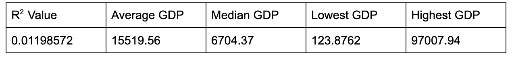
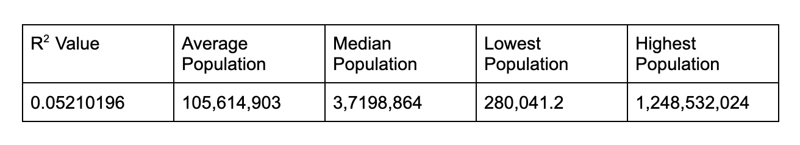

```{r load-packages, include = FALSE}
# Add any additional packages you need to this chunk
library(tidyverse)
library(tidymodels)
library(palmerpenguins)
library(knitr)
library(xaringanthemer)
library(readr)
library(broom)
library(openintro)
#devtools::install_github("jennybc/gapminder")
library(gapminder)
```

```{r setup, include=FALSE, echo=FALSE}
# For better figure resolution
knitr::opts_chunk$set(fig.retina = 3, dpi = 300, fig.width = 6, fig.asp = 0.618, out.width = "80%")
```

```{r load-data, include=FALSE, echo=FALSE}
Summer_olympics <- read_csv("Summer-Olympic-medals-1976-to-2008.csv")
Country_codes <-read_csv("coutry-and-continent-codes.csv")
gdp_data <- read_csv("gdp_data.csv")
```


```{r augmenting-data, echo=FALSE}
#names(Country_codes)[names(Country_codes) == 'Three_Letter_Country_Code'] <- 'Country_code'
Olympic_final <- Summer_olympics %>%
   left_join(
      Country_codes, 
      by = c("Country_Code" = "Three_Letter_Country_Code") ) %>%
   mutate(
      Medal_value = case_when(
      Medal == "Gold" ~ 3,
      Medal == "Silver" ~ 2,
      Medal == "Bronze" ~ 1)) %>%
   filter(Year == c(1996, 2000, 2004, 2008)) %>%
   left_join(
      gapminder,
      by = c("Country" = "country")
   )
```

```{r summarising-medals, echo=FALSE, message=FALSE, warning=FALSE}
#Creating Bronze, Silver, and Gold columns and removing excess
Olympic_collapse <- Olympic_final %>%
  group_by(Country) %>%
  mutate(
  Bronze = sum(str_count(Medal, "Bronze")),
  Silver = sum(str_count(Medal, "Silver")),
  Gold = sum(str_count(Medal, "Gold"))) %>%
  select(Country, Medal, Continent_Name) %>%
  group_by(Country, Medal) %>%
  mutate(Continent_Name = case_when(
      Country %in% c("Germany", "Netherlands", "Yugoslavia", "Bulgaria",
                     "Switzerland", "Slovenia", "Denmark", "Croatia", "Greece",
                     "Portugal", "Serbia", "Latvia") ~ "Europe",
      Country %in% c("Bahamas", "Costa Rica") ~ "North America",
      Country %in% c("Trinidad and Tobago", "Chile", "Paraguay") ~ "South America",
      Country %in% c("Indonesia", "Taiwan", "Vietnam", "Iran",  "Malaysia",
                     "Mongolia") ~ "Asia",
      Country %in% c("Zimbabwe", "Nigeria", "South Africa", "Algeria") ~ "Africa",  
       TRUE    ~ Continent_Name)) %>%
  relocate(Continent_Name, .after = Country) %>%
   count(Continent_Name = Continent_Name)%>%
  pivot_wider(names_from = Medal, values_from = n) %>%
  mutate_all(~replace(., is.na(.), 0)) %>%
  relocate(Gold, .after = Silver) 
```

class: inverse, center, middle

```{r merging_gdp_with_olympic, echo=FALSE, message=FALSE, warning=FALSE}
   Olympic_final_new <- merge(Olympic_final, gdp_data,
   by=c("Year","Country_Code"))
```

```{r summarise-medals-with-gdp, echo=FALSE, message=FALSE, warning=FALSE}
Olympic_gdp<-Olympic_final_new %>%
   select(Country, Year, gdp, Medal_value, pop) %>%
   group_by(Country, Year, gdp, pop) %>%
   summarise(Medal_value=n())
```


```{r echo=FALSE, message=FALSE, warning=FALSE}
style_xaringan(
  title_slide_background_image = "img/olympic_rings_on_white_206913.jpg"
)
```


## Introduction page

Our original question that we wanted research was "which regions are the best at which sport". After analyzing our pros and cons of our data we decided to re do our research question.We decided to analyze out research in comparing USA to other countries in specific areas of sport and comparing  an country’s GDP to how well they medaled in each four of the Olympics. 

We created two mutated data sets of our orginal data set to make our analysis of our data easier

---

class: inverse, center, middle

## What sections/topics we decided to anaylze 

Our first analysis of the data was analyzing the United States against other countries in different athletic advents. We picked the United States because of the probability that we would get data for all four Olympics in our events. For each section of analyzing the Unite States we analyzed them against certain countries that we believed would do well in those events 


---

class: inverse, middle, center

## North America graph

```{r NA_graph, echo=FALSE}
Olympic_final %>%
   filter(Continent_Name == "North America") %>%
  ggplot(aes(x = Country, y = Medal_value, fill = Medal)) +
  geom_col()  +
  labs(y = "Total Medal Value") +
  facet_wrap(~ "Continent_Name") +
  labs(title = "Top Medal Count in North America")
```

---

class: inverse, middle, center

## Cuba vs North America Medal Count

```{r Cuba_US_graph_Total_Medals, echo=FALSE, fig.width=8, warning=FALSE, out.width="75%"}
Olympic_final %>%
   filter(Country == c("United States", "Cuba")) %>%
   ggplot(aes(x = Year, y = Medal_value, fill = Medal)) + 
   labs(x = "Year", y = "Total Medal Value", 
   title = "Total Medal Count for USA and Cuba") +
   geom_col() +
   facet_wrap(~ Country) +
   scale_x_continuous(breaks = seq(1996,2008, by = 4), labels = c("1996", "2000", "2004", "2008"))
```
 

---

class: inverse, middle, center

## GDP Regression Statistics 

```{r GDP_Stats, echo = FALSE, out.height= 200,out.width=1000, fig.align = "center"}



```


---

class: inverse, middle, center

### Regressing GDP on Medal Value

```{r regression-gdp, echo=FALSE, message=FALSE, fig.width=8, warning=FALSE, out.width="75%"}
Olympic_gdp %>%
ggplot(mapping = aes(x = gdp, y = Medal_value)) +
  geom_point(alpha = 0.5)+
  geom_jitter() +
  geom_smooth(method = "lm", se = FALSE, size = 1) +
  labs(title = "Regressing GDP on Medal Value", y = "Total Medal Value", x = "GDP")
```

---

class: inverse, middle, center

## Population Regression Statistics 

```{r pop_stats, echo = FALSE, out.height= 200,out.width=1000, fig.align = "center"}



```


---

class: inverse, middle, center

## Regressing Population on Medal Value 

```{r regression-pop, echo=FALSE, message=FALSE, fig.width=8, warning=FALSE, out.width="75%"}
Olympic_gdp %>%
   filter(pop <= 80000000) %>%
  ggplot(mapping = aes(x = pop, y = Medal_value)) +
  geom_point(alpha = 0.5)+
  geom_jitter(width = 1000000) +
  geom_smooth(method = "lm", se = FALSE, size = 1) +
  labs(title = "Regressing Population on Medal Value", y = "Total Medal Value", x = "Population")
```

---


# xaringan

- The presentation is created using the `xaringan` package

- Use `---` to separate slides and `--` for incremental builds

--

- Like this

---

# Layouts

You can use plain text

- or bullet points

.pull-left[
or text in two columns $^*$
]
.pull-right[
- like
- this
]

.footnote[
[*] And add footnotes
]

---

# Code

```{r boring-regression}
# a boring regression
#model <- lm(dist ~ speed, data = cars)
#tidy(model)
#glance(model)
```

---

# Plots

```{r recode-species, echo = FALSE}

# In this chunk I'm doing a bunch of analysis that I don't want to present in my slides. But I need the resulting data frame for a plot I want to present.

iris_modified <- iris %>%
  mutate(Species = fct_other(Species, keep = "setosa"))
```

```{r plot-iris, echo = FALSE}
#Code hidden with echo = FALSE
 #Uses modified iris dataset from previous chunk
#Play around with height and width until you're happy with the look


ggplot(data = iris_modified, mapping = aes(x = Sepal.Width, y = Sepal.Length, color = Species)) +
 geom_point() + 
  theme_minimal() # theme options: https://ggplot2.tidyverse.org/reference/ggtheme.html
```

---

## Plot and text

.pull-left[
- Some text
- goes here
]
.pull-right[
```{r warning=FALSE, out.width="100%", fig.width=4, echo=FALSE}
# see how I changed out.width and fig.width from defaults
# to make the figure bigger
#ggplot(penguins, aes(x = bill_length_mm, y = species, color = species)) +
#  geom_boxplot() +
 # theme_minimal()
```
]

---


# Images

```{r castle, echo = FALSE, out.width = "60%", fig.align = "center", fig.cap = "Image credit: Photo by Jörg Angeli on Unsplash."}
include_graphics("https://images.unsplash.com/photo-1535448033526-c0e85c9e6968?ixlib=rb-1.2.1&ixid=eyJhcHBfaWQiOjEyMDd9&auto=format&fit=crop&w=1650&q=80")
```

Or you can also include a full page image. See next slide.

---

background-image: url(https://images.unsplash.com/photo-1535448033526-c0e85c9e6968?ixlib=rb-1.2.1&ixid=eyJhcHBfaWQiOjEyMDd9&auto=format&fit=crop&w=1650&q=80)

---

# Math Expressions

You can write LaTeX math expressions inside a pair of dollar signs, e.g. &#36;\alpha+\beta$ renders $\alpha+\beta$. You can use the display style with double dollar signs:

```
$$\bar{X}=\frac{1}{n}\sum_{i=1}^nX_i$$
```

$$\bar{X}=\frac{1}{n}\sum_{i=1}^nX_i$$

Limitations:

1. The source code of a LaTeX math expression must be in one line, unless it is inside a pair of double dollar signs, in which case the starting `$$` must appear in the very beginning of a line, followed immediately by a non-space character, and the ending `$$` must be at the end of a line, led by a non-space character;

1. There should not be spaces after the opening `$` or before the closing `$`.

1. Math does not work on the title slide (see [#61](https://github.com/yihui/xaringan/issues/61) for a workaround).

---

# Feeling adventurous?

- Want to find out more about `xaringan`? See https://slides.yihui.name/xaringan/#1.

- You are welcomed to use the default styling of the slides. In fact, that's what I expect majority of you will do. You will differentiate yourself with the content of your presentation.

- But some of you might want to play around with slide styling. The 
`xaringanthemer` provides some solutions for this that: https://pkg.garrickadenbuie.com/xaringanthemer.

- And if you want more bells and whistles, there is also `xaringanExtra`: https://pkg.garrickadenbuie.com/xaringanExtra.
