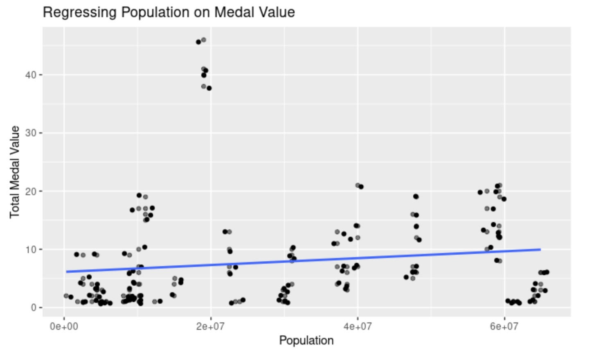

```{r load-packages, include = FALSE}
# Add any additional packages you need to this chunk
library(tidyverse)
library(tidymodels)
library(palmerpenguins)
library(knitr)
library(xaringanthemer)
library(readr)
library(broom)
library(openintro)
#devtools::install_github("jennybc/gapminder")
library(gapminder)
```

```{r setup, include=FALSE, echo=FALSE}
# For better figure resolution
knitr::opts_chunk$set(fig.retina = 3, dpi = 300, fig.width = 6, fig.asp = 0.618, out.width = "80%")
```

```{r load-data, include=FALSE, echo=FALSE}
Summer_olympics <- read_csv("Summer-Olympic-medals-1976-to-2008.csv")
Country_codes <-read_csv("coutry-and-continent-codes.csv")
gdp_data <- read_csv("gdp_data.csv")
```


```{r augmenting-data, echo=FALSE}
#names(Country_codes)[names(Country_codes) == 'Three_Letter_Country_Code'] <- 'Country_code'
Olympic_final <- Summer_olympics %>%
   left_join(
      Country_codes, 
      by = c("Country_Code" = "Three_Letter_Country_Code") ) %>%
   mutate(
      Medal_value = case_when(
      Medal == "Gold" ~ 3,
      Medal == "Silver" ~ 2,
      Medal == "Bronze" ~ 1)) %>%
   filter(Year == c(1996, 2000, 2004, 2008)) %>%
   left_join(
      gapminder,
      by = c("Country" = "country")
   )
```

```{r summarising-medals, echo=FALSE, message=FALSE, warning=FALSE}
#Creating Bronze, Silver, and Gold columns and removing excess
Olympic_collapse <- Olympic_final %>%
  group_by(Country) %>%
  mutate(
  Bronze = sum(str_count(Medal, "Bronze")),
  Silver = sum(str_count(Medal, "Silver")),
  Gold = sum(str_count(Medal, "Gold"))) %>%
  select(Country, Medal, Continent_Name) %>%
  group_by(Country, Medal) %>%
  mutate(Continent_Name = case_when(
      Country %in% c("Germany", "Netherlands", "Yugoslavia", "Bulgaria",
                     "Switzerland", "Slovenia", "Denmark", "Croatia", "Greece",
                     "Portugal", "Serbia", "Latvia") ~ "Europe",
      Country %in% c("Bahamas", "Costa Rica") ~ "North America",
      Country %in% c("Trinidad and Tobago", "Chile", "Paraguay") ~ "South America",
      Country %in% c("Indonesia", "Taiwan", "Vietnam", "Iran",  "Malaysia",
                     "Mongolia") ~ "Asia",
      Country %in% c("Zimbabwe", "Nigeria", "South Africa", "Algeria") ~ "Africa",  
       TRUE    ~ Continent_Name)) %>%
  relocate(Continent_Name, .after = Country) %>%
   count(Continent_Name = Continent_Name)%>%
  pivot_wider(names_from = Medal, values_from = n) %>%
  mutate_all(~replace(., is.na(.), 0)) %>%
  relocate(Gold, .after = Silver) 
```

class: inverse, center, middle

```{r merging_gdp_with_olympic, echo=FALSE, message=FALSE, warning=FALSE}
   Olympic_final_new <- merge(Olympic_final, gdp_data,
   by=c("Year","Country_Code"))
```

```{r summarise-medals-with-gdp, echo=FALSE, message=FALSE, warning=FALSE}
Olympic_gdp<-Olympic_final_new %>%
   select(Country, Year, gdp, Medal_value, pop) %>%
   group_by(Country, Year, gdp, pop) %>%
   summarise(Medal_value=n())
```


```{r echo=FALSE, message=FALSE, warning=FALSE}
style_xaringan(
  title_slide_background_image = "img/olympic_rings_on_white_206913.jpg"
)
```

---

class: inverse, center, middle

## Introduction page

Our original question that we wanted research was "which regions are the best at which sport". After analyzing our pros and cons of our data we decided to re do our research question.We decided to analyze out research in comparing USA to other countries in specific areas of sport and comparing  an country’s GDP to how well they medaled in each four of the Olympics. 

We created two mutated data sets of our orginal data set to make our analysis of our data easier

---

class: inverse, center, middle

## What sections/topics we decided to anaylze 

Our first analysis of the data was analyzing the United States against other countries in different athletic advents. We picked the United States because of the probability that we would get data for all four Olympics in our events. For each section of analyzing the Unite States we analyzed them against certain countries that we believed would do well in those events 


---

class: inverse, middle, center

## North America graph

```{r NA_graph, echo=FALSE}
Olympic_final %>%
   filter(Continent_Name == "North America") %>%
  ggplot(aes(x = Country, y = Medal_value, fill = Medal)) +
  geom_col()  +
  labs(y = "Total Medal Value") +
  facet_wrap(~ "Continent_Name") +
  labs(title = "Top Medal Count in North America")
```

---

class: inverse, middle, center

## Cuba vs North America Medal Count

```{r Cuba_US_graph_Total_Medals, echo=FALSE, fig.width=8, warning=FALSE, out.width="75%"}
Olympic_final %>%
   filter(Country == c("United States", "Cuba")) %>%
   ggplot(aes(x = Year, y = Medal_value, fill = Medal)) + 
   labs(x = "Year", y = "Total Medal Value", 
   title = "Total Medal Count for USA and Cuba") +
   geom_col() +
   facet_wrap(~ Country) +
   scale_x_continuous(breaks = seq(1996,2008, by = 4), labels = c("1996", "2000", "2004", "2008"))
```
 

---

class: inverse, middle, center

## GDP Regression Statistics 

```{r GDP_Stats, echo = FALSE, out.height= 200,out.width=1000, fig.align = "center"}


```


---

class: inverse, middle, center

### Regressing GDP on Medal Value

```{r regression-gdp, echo=FALSE, message=FALSE, fig.width=8, warning=FALSE, out.width="75%"}
Olympic_gdp %>%
ggplot(mapping = aes(x = gdp, y = Medal_value)) +
  geom_point(alpha = 0.5)+
  geom_jitter() +
  geom_smooth(method = "lm", se = FALSE, size = 1) +
  labs(title = "Regressing GDP on Medal Value", y = "Total Medal Value", x = "GDP")
```

---

class: inverse, middle, center

## Population Regression Statistics 

```{r pop_stats, echo = FALSE, out.height= 200,out.width=1000, fig.align = "center"}


```


---

class: inverse, middle, center

## Regressing Population on Medal Value 

```{r pop_stats, echo = FALSE, out.height= 200,out.width=1000, fig.align = "center"}



```


---

class: inverse, middle, center

### Overall Medal Count

```{r Overall-graph, echo=FALSE, message=FALSE, fig.width=8, warning=FALSE, out.width="75%"}
Olympic_overall <- Olympic_collapse %>% 
   group_by(Country) %>%
   mutate(Medal_sum = Bronze + Silver + Gold ) %>%
   arrange(desc(Medal_sum))

Olympic_overall_tograph <- pivot_longer(Olympic_overall, cols= c("Bronze", "Silver", "Gold"), names_to="variable", values_to="value") %>%
  group_by(Country) %>%
  mutate(proportion=value/Medal_sum)

Olympic_overall_tograph %>%
  filter(Medal_sum>60) %>%
  mutate(Country_name = factor(Country, levels=c("Russia", "United States", "Australia", "Germany", "China", "Netherlands", "Cuba", "Brazil"))) %>%
  ggplot(aes(x=Country_name, y=value, fill = variable)) +
  labs(title = "Winningest Countries in the World", x = "Country", y = "Total Medal Count", fill = "Medal Type") +
  geom_col() +
  theme(axis.text.x = element_text(angle = 45))
```

---


